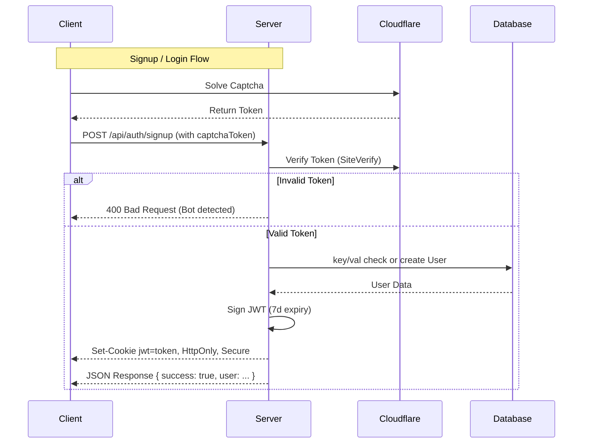

# Authentication System Architecture

## High-Level Overview
The application uses a secure authentication system based on **JSON Web Tokens (JWT)** and **HTTP-only cookies**. 
1. When a user signs up or logs in, the server handles credential validation and creates a user record in MongoDB.
2. A JWT is signed containing the user's ID.
3. This token is sent back to the client in a secure, HTTP-only cookie named `jwt`.
4. Subsequent requests to protected routes include this cookie, which the `protectRoute` middleware verifies.

### Security Enhancements
*   **Cloudflare Turnstile**: Both Signup and Login forms are protected by CAPTCHA to prevent bot attacks. The frontend generates a token, and the backend verifies it with Cloudflare before processing credentials.

## Auth Flow Diagram


    Note over C, S: Protected Route Flow
    C->>S: GET /api/some-protected-resource
    S->>S: protectRoute Middleware checks 'jwt' cookie
    alt Token Valid
        S->>DB: Find User by ID in token
        DB-->>S: User Data
        S->>S: Attach user to req (req.user)
        S-->>C: Resource Data
    else Token Invalid/Missing
        S-->>C: 401 Unauthorized
    end
```

## Routes & Functionality

| Method | Endpoint | Description |
| :--- | :--- | :--- |
| **POST** | `/api/auth/signup` | Registers a new user, hashes password, creates Stream user, and issues a JWT. |
| **POST** | `/api/auth/login` | Authenticates user credentials and issues a JWT. |
| **POST** | `/api/auth/logout` | Clears the `jwt` cookie. |
| **POST** | `/api/auth/onboarding` | Updates user details (bio, languages) after initial signup. Syncs update to Stream. |
| **POST** | `/api/auth/forgot-password` | Generates a reset token and sends a reset link via email (using Resend). |
| **POST** | `/api/auth/reset-password/:token` | Verifies the reset token and updates the user's password. |

## Key Code Snippets

### JWT Signing
Located in `backend/src/controllers/auth.controller.js`:
```javascript
const token = jwt.sign({ userId: newUser._id }, process.env.JWT_SECRET_KEY, {
    expiresIn: '7d'
});

res.cookie("jwt", token, {
    maxAge: 7 * 24 * 60 * 60 * 1000, // 7 days
    httpOnly: true, // prevent XSS
    sameSite: "strict", // prevent CSRF
    secure: process.env.NODE_ENV === "production"
});
```

### Protection Middleware
Located in `backend/src/middleware/auth.middleware.js`. This ensures only  authenticated users can access specific routes.
```javascript
export const protectRoute = async (req, res, next) => {
    try {
        const token = req.cookies.jwt;

        if (!token) {
            return res.status(401).json({ message: "Unauthorized - No token provided" });
        }

        const decoded = jwt.verify(token, process.env.JWT_SECRET_KEY);

        if (!decoded) {
            return res.status(401).json({ message: "Unauthorized - Invalid token" });
        }

        const user = await User.findById(decoded.userId).select("-password");
        if (!user) {
            return res.status(401).json({ message: "Unauthorized - User not found" });
        }

        req.user = user;
        next();
    } catch (error) {
        // ... error handling
    }
}
```

## Libraries & Tools
- **jsonwebtoken**: Used to sign and verify tokens.
- **bcryptjs**: Used to salt and hash passwords before storage, and to compare passwords during login.
- **cookie-parser**: Used to parse cookies from incoming request headers so the middleware can read `req.cookies.jwt`.
